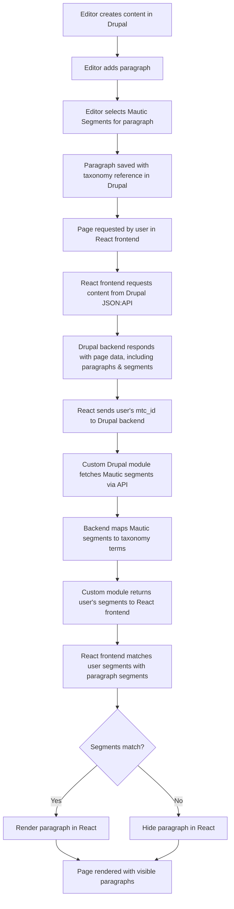

```mermaid
graph TD
    A[Editor creates content in Drupal] --> B[Editor adds paragraph]
    B --> C[Editor selects Mautic Segments for paragraph]
    C --> D[Paragraph saved with taxonomy reference in Drupal]

    %% Backend starts
    D --> E[Page requested by user in React frontend]
    E --> F[React frontend requests content from Drupal JSON:API]
    F --> G[Drupal backend responds with page data, including paragraphs & segments]

    G --> H[React sends user's mtc_id to Drupal backend]
    H --> I[Custom Drupal module fetches Mautic segments via API]
    I --> J[Backend maps Mautic segments to taxonomy terms]

    J --> K[Custom module returns user's segments to React frontend]

    %% Frontend starts
    K --> L[React frontend matches user segments with paragraph segments]
    L --> M{Segments match?}
    M -->|Yes| N[Render paragraph in React]
    M -->|No| O[Hide paragraph in React]

    N --> P[Page rendered with visible paragraphs]
    O --> P

```